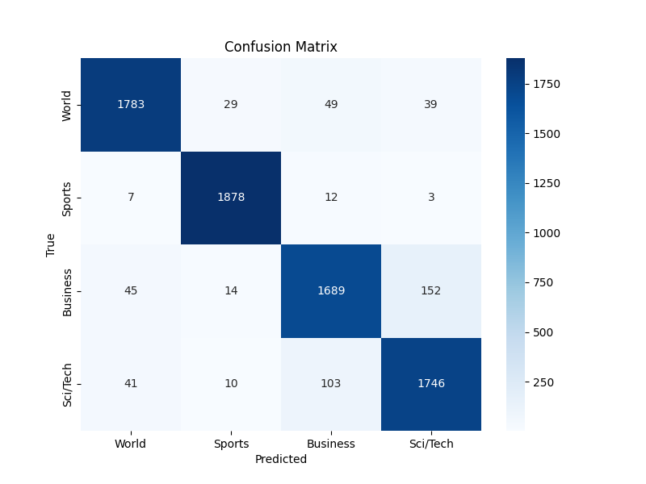

# GPT-2 News Classification using Transfer Learning

## Project Overview

This project classifies news articles into four categories using a fine-tuned GPT-2 model. GPT-2 is implemented entirely from scratch in PyTorch, not using HuggingFace's model classes. Pretrained weights are loaded from OpenAI's original TensorFlow checkpoint using a custom weight-mapping pipeline. Transfer learning is applied by fine-tuning only the last 3 transformer blocks and the classification head, keeping the remaining 9 blocks frozen to preserve general language understanding. The full pipeline covers data preparation, custom dataset and dataloader construction, model architecture, weight loading, training, evaluation, and inference.

## Problem Statement

Input: A news article as a plain text string

Output: One of four categories — World, Sports, Business, Sci/Tech

```text
News Article Text
       ↓
GPT-2 BPE Tokenizer
       ↓
GPT-2 Backbone (12 Transformer Blocks)
       ↓
Last Token Representation (768-dimensional vector)
       ↓
Classification Head (Linear 768 → 4)
       ↓
4-Class Prediction
```

## Dataset

Source: AG News — https://huggingface.co/datasets/fancyzhx/ag_news

| Label | Category | Training Examples |
|-------|----------|-------------------|
| 0     | World    | 30,000            |
| 1     | Sports   | 30,000            |
| 2     | Business | 30,000            |
| 3     | Sci/Tech | 30,000            |

| Split      | Examples | Source                             |
|------------|----------|------------------------------------|
| Train      | 102,000  | 85% of original training split     |
| Validation | 18,000   | 15% of original training split     |
| Test       | 7,600    | Original test split (held out)     |

The dataset is balanced — no class weighting was necessary.

## Model Architecture

| Parameter           | Value   |
|---------------------|---------|
| Vocabulary size     | 50,257  |
| Context length      | 1,024   |
| Embedding dimension | 768     |
| Attention heads     | 12      |
| Transformer blocks  | 12      |
| Total parameters    | ~124M   |
| Trainable params    | ~21M    |

Components built from scratch: multi-head self-attention, causal masking, layer normalisation, GELU activation, feed-forward blocks (768 → 3072 → 768), positional embeddings, and residual connections.

Last-token classification strategy: the classification decision is taken from the output at the final token position because GPT-2 uses causal attention and the last token has attended over the full input sequence.

## Training Strategy

- All 12 transformer blocks and the language modelling head are loaded with OpenAI's pretrained weights
- All parameters are frozen except the last 3 transformer blocks, the final layer norm, and the new classification head
- The original output head (768 → 50,257) is replaced with a new randomly-initialised classification head (768 → 4)
- The new classification head is trained to predict one of four news categories

| Hyperparameter              | Value         |
|-----------------------------|---------------|
| Optimizer                   | AdamW         |
| Learning rate               | 9e-6          |
| Weight decay                | 0.1           |
| Batch size                  | 32            |
| Epochs                      | 3             |
| Gradient clipping           | 1.0           |
| Eval batches (intermediate) | 5             |
| Evaluations per epoch       | 4             |
| Train acc batches (epoch)   | 20% of train loader |
| Unfrozen transformer blocks | Last 3        |
| Loss function               | Cross-entropy |

Evaluation strategy: every N steps (`evals_per_epoch` per epoch), intermediate **training** loss is computed on a small subset of train batches (`eval_iter`) while **validation** loss uses the full validation loader. At each epoch end, training accuracy is estimated on 20% of train batches (`train_acc_batch_fraction`) and validation accuracy on the full validation set. After training, final evaluation runs on the full train, validation, and test sets.

## Results

Metrics below were produced after fine-tuning (3 epochs) with the notebook evaluation cells. Pre-training and final accuracy tables use the configured intermediate eval subset and full-split evaluation respectively. The classification report and confusion matrix are computed on the **test set** (7,600 examples).

First table — Pre-training baseline (random 4-class head, before fine-tuning; not LM zero-shot):

| Split      | Accuracy |
|------------|----------|
| Train      | 27.50%   |
| Validation | 26.88%   |
| Test       | 28.75%   |

Second table — Fine-tuned model (after training):

| Split      | Accuracy |
|------------|----------|
| Train      | 94.78%   |
| Validation | 93.72%   |
| Test       | 93.37%   |

Classification report — fine-tuned model (test set):

| Class    | Precision | Recall | F1-Score | Support |
|----------|-----------|--------|----------|---------|
| World    | 0.95      | 0.94   | 0.94     | 1900    |
| Sports   | 0.97      | 0.99   | 0.98     | 1900    |
| Business | 0.91      | 0.89   | 0.90     | 1900    |
| Sci/Tech | 0.90      | 0.92   | 0.91     | 1900    |
| Accuracy |           |        | 0.93     | 7600    |

Macro avg: precision 0.93, recall 0.93, F1 0.93. Weighted avg: precision 0.93, recall 0.93, F1 0.93.

Confusion matrix — fine-tuned model (rows are true labels, columns are predicted):

|          | World | Sports | Business | Sci/Tech |
|----------|-------|--------|----------|----------|
| World    | 1783  | 29     | 49       | 39       |
| Sports   | 7     | 1878   | 12       | 3        |
| Business | 45    | 14     | 1689     | 152      |
| Sci/Tech | 41    | 10     | 103      | 1746     |



To reproduce these numbers, run the evaluation cells at the end of `notebooks/fine-tuned-gpt-2-news-classifier.ipynb`.

## Installation and Usage

Installation:

```bash
git clone <repo-url>
cd fine-tuned-gpt-2-news-classifier
pip install -r requirements.txt
pip install -r requirements-tf.txt   # only needed to download/load GPT-2 checkpoints
```

TensorFlow is required only for loading the original GPT-2 TensorFlow checkpoint (`requirements-tf.txt`). It is not used during training or inference after weights are loaded.

Running the notebook:

```bash
jupyter notebook notebooks/fine-tuned-gpt-2-news-classifier.ipynb
```

Cells must be run sequentially. The pretrained GPT-2 weights (~500MB) are downloaded automatically on first run.

Running tests (from the project root):

```bash
python -m pytest tests/ -v
```

Inference example (after fine-tuning; the notebook uses `configure_transfer_learning()` for the full freeze/unfreeze setup):

```python
from src.models.gpt2_classifier import configure_transfer_learning
from src.inference.predict import classify_news

# If the model still has the LM head, run once after loading pretrained weights:
# configure_transfer_learning(model)

result = classify_news(
    "Scientists discover new exoplanet with potential for liquid water",
    model, tokenizer, device,
    max_length=256  # truncate cap only; inference uses actual sequence length (no padding)
)
print(result)  # Output: Sci/Tech
```

## Project Structure

```text
fine-tuned-gpt-2-news-classifier/
│
├── README.md                                 — project overview and quickstart guide
├── requirements.txt                          — Python dependency declarations
├── requirements-tf.txt                       — optional TensorFlow (GPT-2 checkpoint loading only)
├── .gitignore                                — git exclusion rules
├── LICENSE                                   — project license file
│
├── notebooks/
│   └── fine-tuned-gpt-2-news-classifier.ipynb — main project notebook (orchestration layer)
│
├── src/                                      — modularized source code
│   ├── config/
│   │   └── config.py                        — CONFIG, LABELS, logger, validate_config()
│   ├── data/
│   │   ├── columns.py                       — shared CSV column names and tokenizer constants
│   │   ├── preprocessing.py                 — AG News download, split, load_data, frame validation
│   │   ├── dataset.py                       — NewsDataset class (tokenisation and encoding)
│   │   └── dataloader.py                    — DataLoader factory with custom_collate_fn (dynamic padding)
│   ├── models/
│   │   ├── layers.py                        — LayerNorm, GELU, and FeedForward built from scratch
│   │   ├── attention.py                     — MultiHeadAttention with causal masking
│   │   ├── transformer_block.py             — single TransformerBlock (attention + FF + residuals)
│   │   └── gpt2_classifier.py              — GPTModel, replace_classification_head, configure_transfer_learning
│   ├── training/
│   │   ├── train.py                         — training loop with tqdm, TPU support, checkpointing
│   │   ├── evaluate.py                      — loss computation and evaluation helpers
│   │   ├── logits.py                        — extract_last_token_logits shared helper
│   │   └── metrics.py                       — accuracy, save_loss_plot, save_accuracy_plot, classification report
│   ├── inference/
│   │   └── predict.py                       — classify_news function for single-article inference
│   └── utils/
│       ├── seed.py                          — set_seed for reproducibility
│       └── helpers.py                       — GPT-2 weight download, TF checkpoint loading, QKV split
│
├── tests/                                    — pytest test suite
│   ├── conftest.py                          — shared fixtures (mini GPT config, classification model, sample data)
│   ├── test_config.py                       — CONFIG structure, LABELS, and validate_config
│   ├── test_data.py                         — NewsDataset, custom_collate_fn, and dataloader behaviour
│   ├── test_preprocessing.py                — AG News frame validation helpers
│   ├── test_models.py                       — GPTModel, attention, layers, transformer block
│   ├── test_training.py                     — loss computation and logits extraction
│   ├── test_metrics.py                      — loss plot saving helpers
│   ├── test_inference.py                    — classify_news inference pipeline
│   └── test_seed.py                         — seed reproducibility
│
├── docs/
│   ├── ARCHITECTURE.md                       — deep technical reference
│   └── images/
│       └── confusion_matrix.png              — test-set confusion matrix (for README)
│
├── data/                                     — [GITIGNORED] generated CSV splits
├── gpt2/                                     — [GITIGNORED] downloaded pretrained weights (~500MB)
├── models/                                   — [GITIGNORED] saved fine-tuned model and metadata
└── plots/                                    — [GITIGNORED] loss and accuracy plots
```

## Key Implementation Notes

The weight loading pipeline downloads OpenAI's TensorFlow checkpoint and manually maps each variable to the corresponding PyTorch parameter. The combined QKV projection matrix (shape 768×2304) stored in the TensorFlow checkpoint is split into three separate matrices (each 768×768) to match the from-scratch PyTorch implementation.

Weight tying (pretrained LM only): when OpenAI weights are loaded, the token embedding matrix and the language-modeling output head share the same weight matrix (`wte`), matching the original GPT-2 architecture. The same 50,257×768 matrix embeds input tokens and projects final representations back to vocabulary scores. For news classification, `configure_transfer_learning()` (or `replace_classification_head()`) replaces that LM head with a separate, randomly initialised 768→4 layer; tying no longer applies after that step, which is required before calling `classify_news()`.

The classification uses only the last token's output because GPT-2's causal attention ensures that token has attended over all preceding tokens, making it the most informed representation for the full input.

## References

- Radford et al., "Language Models are Unsupervised Multitask Learners" — the original GPT-2 paper
- AG News dataset: https://huggingface.co/datasets/fancyzhx/ag_news
- Original GPT-2 weights and architecture: https://github.com/openai/gpt-2

## Architecture Reference

For a deep technical walkthrough of every component — model internals, weight
loading pipeline, transfer learning strategy, data pipeline, training loop, and
inference pipeline — see [docs/ARCHITECTURE.md](docs/ARCHITECTURE.md).

## Future Enhancements

The following improvements are out of scope for the current initial release but represent meaningful next steps for scaling and optimization.

### Hyperparameter Optimisation

The current hyperparameters (learning rate, batch size, number of unfrozen blocks, weight decay) were chosen manually. A systematic search using Bayesian Optimisation via Optuna or Ray Tune would likely find a combination that improves test accuracy by several percentage points. Each trial would run a shortened training run and report validation accuracy, allowing the optimiser to converge on better settings efficiently.

### LoRA Fine-Tuning

Instead of fully fine-tuning the last three transformer blocks, Low-Rank Adaptation (LoRA) inserts small trainable rank-decomposition matrices into the attention projections while keeping all original weights frozen. This reduces the number of trainable parameters dramatically (from ~21M to well under 1M) while achieving comparable or better accuracy. It also reduces GPU memory requirements during training significantly.

### Mixed Precision Training

Training with 16-bit floating point (FP16 or BF16) instead of the default 32-bit reduces GPU memory consumption by approximately half and speeds up training on modern hardware that has native 16-bit compute units. PyTorch supports this via `torch.cuda.amp.autocast` and `GradScaler` with minimal code changes.

### Distributed Training

For scaling to larger models or larger datasets, distributing training across multiple GPUs using PyTorch's `DistributedDataParallel` would provide near-linear speedup with the number of GPUs. This would require restructuring the training loop to use a distributed sampler and process group initialization.

### Production Inference API

Wrapping the `classify_news` function in a FastAPI application would make the model accessible as a REST endpoint. A complete deployment would include input validation, batch inference support, JSON responses, Docker containerisation, and optionally a lightweight frontend. This is the natural next step after the model is trained and evaluated to a satisfactory standard.

### Experiment Tracking

Integrating a tool like MLflow or Weights and Biases would centralise automatic logging of hyperparameters, metrics, model artifacts, and plots across multiple runs (the notebook still prints some accuracy summaries to stdout). This makes it easy to compare experiments and reproduce any previous result.
